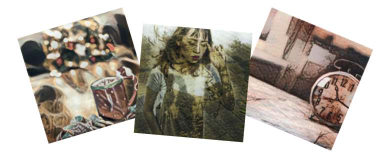

# AI-rtsie, *the artsy storyteller*

by [Gergely Farkas](https://github.com/gerrrd), [Masha Chelova](https://github.com/MashaChelova) & [Erika Große Hokamp](https://github.com/ErikaGH)

[AI-rtsie](http://www.ai-rtsie.com/) is a language processing and neural network based application that turns text into ✨*artsy*✨ images.

We built AI-rtsie as our final project for the Le Wagon Data Science Bootcamp. Our idea was to provide people a means of visualising their stories, thoughts, experiences, etc. We know that a picture can say more than a thousand words, and with AI-rtsie it is possible to do so; by generating corresponding artsy images, our application can help people enrich their communication.

# How does it work?

The general workflow of AI-rtsie starts with a user entering a text into the web interface and hitting the submit button. Once this happens, the text is sent via an API to a backend for actual processing. There, key words from the text are extracted in order to search for appropriate images on the web. The images are then used as input into an image processing algorithm, which then mixes sets of two pictures to output combined stylized images. After all the processing is done, the images are sent back to the frontend interface and displayed for the user's enjoyment.

#### Language processing

In order to handle the language processing step of the workflow, we use a Python library called `SpaCy`. The first step is to identify "*noun chunks*" in the text, i.e. nouns with their corresponding context. The number of noun chunks corresponds to the number of images that will be generated for a particular text.

*Example:*  "tall lady", "red dress", "dog"

Since our stylized images are generated by mixing two images -- a content image and a style image -- we further process the noun chunks to find two keywords that characterize each chunk and that will be later used for image search. We decided to use the actual noun within a noun chunk for the base, i.e. content image, and the modifying word(s) (adjectives) for the style image. In case the noun in the noun chunk does not have any modifier, we use the lemmatized version of a random verb from the text for the style image search.

*Example:*

| Content | Style                   |
| ------- | ----------------------- |
| "lady"  | "tall"                  |
| "dress" | "red"                   |
| "dog"   | ["see", "wear", "walk"] |

If the text entered by the user cannot be processed the above described way, or if a word used in the text is not recognized by the language processing algorithm, then AI-rtsie will displays an error message prompting the user to try again.

#### Image retrieval

Once the language processing is done, we use the extracted keywords to search for corresponding images on the web. We specifically use two popular stock photos providers: Unspash and Pixabay. Both websites offer API services that can be easily called from within our scripts. One call is made for every keyword and the image to be used is selected at random out from the search query results. We then extract author information for each image from the results, and more importantly the image URLs, which are then used by the image processing algorithm to fetch them.

#### Image processing

The image processing algorithm used to generate AI-rtsies stylized images is called Neural Style Transfer. This algorithm is freely available in the `Tensorflow` Python library. It takes two images as inputs, a content image and a style image, and then transfers the features of the style image onto the content image.

In order for the curious user to understand how his/her stylized images came about, we included a collapsable info box in our frontend application, where the user can see the original images that were used for each of the artsy images generated for the inputed text.

## How is AI-rtsie made available to users?

AI-rtsie's functionality depends on a two-part system. The first part - the one with which the user interacts, i.e. frontend - is [coded](https://github.com/gerrrd/websiteairtsie) using a simple Python framework called `Streamlit` and is hosted on a cloud services platform called Heroku.

However, all of the calculations and heavy lifting are done on the second part - the backend. AI-rtsie's backend consists of a docker container that is hosted and running on Google Cloud Platform. All of the code that is necessary to perform the language processing, image retrieval and image processing is stored inside the container.

In order for the frontend to communicate with the backend (and viceversa) we built an API using the `FastAPI` and `uvicorn` Python libraries. The code for the API is also inside the container, and since the container is not only hosted on the cloud platform but also running, i.e. running the scripts, it can "hear" whenever the frontend is asking the backend to perform an operation. Once all the necessary work is done, the backend sends the ready made product to the frontend, and the user can enjoy their artsy story ❤️

